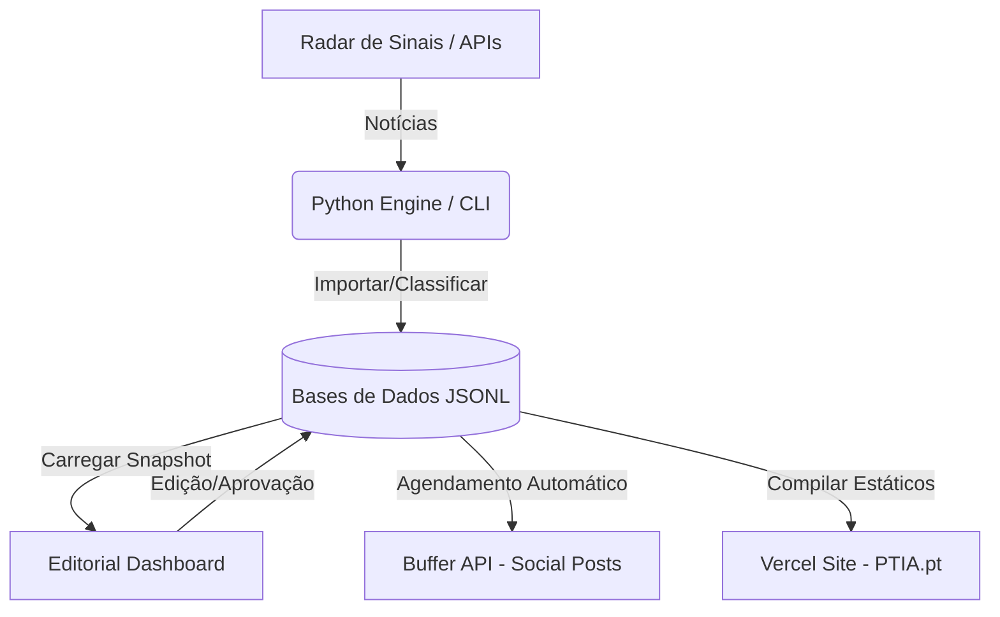

# PTIA Content Engine — Context & Operations Manual

Este ficheiro serve como o **cérebro operacional** e manual de referência rápida para o desenvolvimento, manutenção e curadoria do portal **PTIA.pt**.

---

## 🎯 1. Visão Geral do Projeto

O **PTIA Content Engine** é uma plataforma editorial e curadoria inteligente que filtra o ruído internacional sobre Inteligência Artificial, traduzindo as notícias de ponta para o contexto real de Portugal (**Ângulo PTIA**), focando-se em Decisores, Founders, Startup Builders e Reguladores nacionais.

* **Site Oficial (Produção):** [https://ptia.pt](https://ptia.pt) (Alojado na **Vercel**, deploy automático via ramo `main` do GitHub).
* **Editorial Dashboard (Cloud PaaS):** [https://ptia-dashboard.onrender.com](https://ptia-dashboard.onrender.com) (Alojado no **Render**, 24/7 online para curadoria em mobilidade).

---

## 🏗️ 2. Arquitetura do Sistema



* **`src/ptia_engine/`**: O motor central em Python (crawler, inteligência de rascunhos, classificação multi-categoria e integração de APIs).
* **`site/`**: O portal estático e SPA (Single Page Application) em Vanilla HTML, CSS e JS que corre em [ptia.pt](https://ptia.pt).
* **`data/`**: A base de dados transacional em formato JSONL (focada em performance e escrita atómica para evitar corrupções de dados).
* **`scripts/`**: Scripts de automação diária para agendamento transacional de posts e publicações.

---

## 🛠️ 3. Cheatsheet de Comandos (CLI)

Todos os comandos devem ser executados a partir da raiz do repositório configurando o `PYTHONPATH`:

### Lançar o Dashboard Localmente
Inicia o painel editorial na porta `8765`:
```bash
$env:PYTHONPATH="src"; python -m ptia_engine.cli dashboard --port 8765
```

### Treinar Pesos de Aprendizagem (Closed-Loop)
Analisa o histórico de performance e ajusta as prioridades de classificação automática das próximas notícias em `config/learning_weights.json`:
```bash
$env:PYTHONPATH="src"; python -m ptia_engine.cli learn
```

### Importar Métricas do Instagram (Automático)
Importa métricas recentes das publicações do Instagram diretamente do Meta Graph API para a base de dados de performance local:
```bash
$env:PYTHONPATH="src"; python -m ptia_engine.cli instagram_insights --limit 25
```

---

## 🔑 4. Variáveis de Ambiente Necessárias (`.env.local`)

Para que as integrações externas operem com estabilidade, garanta que as seguintes chaves estão configuradas:

| Variável | Função |
| :--- | :--- |
| **`GEMINI_API_KEY`** | API da Google Gemini para geração e classificação de rascunhos de IA. |
| **`BUFFER_API_KEY`** | Token de acesso para a API do Buffer (agendamento nas redes sociais). |
| **`META_ACCESS_TOKEN`** | Token de acesso de programador para a API do Meta Graph (Instagram). |
| **`META_INSTAGRAM_BUSINESS_ID`** | Identificador de Conta Business de Instagram ligada à sua página de Facebook. |
| **`PTIA_PUBLIC_SITE_URL`** | URL base de produção (`https://ptia.pt`). |

---

## 🏆 5. Ledgers de Conquistas Recentes

### 🔗 Automação de Backlinks Dinâmicos (30 de Maio de 2026)
* **LinkedIn & X**: O motor editorial reformata automaticamente as CTAs dos posts sociais. Em vez de apontar para links externos (como NBC News), injeta o backlink direto para a análise no portal `ptia.pt` (ex: `https://ptia.pt/artigos/slug...`).
* **Regra de 280 caracteres no X**: O gerador calcula as dimensões de forma exata e trunca o tweet mantendo a integridade da ligação ao site.

### 🌐 Validação do Google Search Console (30 de Maio de 2026)
* **Status**: **100% Validado**.
* Inserida a Meta Tag de verificação do Google no cabeçalho do `site/index.html`. A propriedade foi verificada no Google Search Console, ativando o rastreio e indexação orgânica imediata de todos os artigos através do `sitemap.xml`.

### 📧 Newsletter MailerLite Ativa
* **Status**: **100% Funcional**.
* O formulário da frontpage está diretamente interligado com o endpoint JSONP da MailerLite (`subscribe`), capturando subscritores e automatizando o double opt-in para a *Weekly Briefing* a cada sexta-feira.
