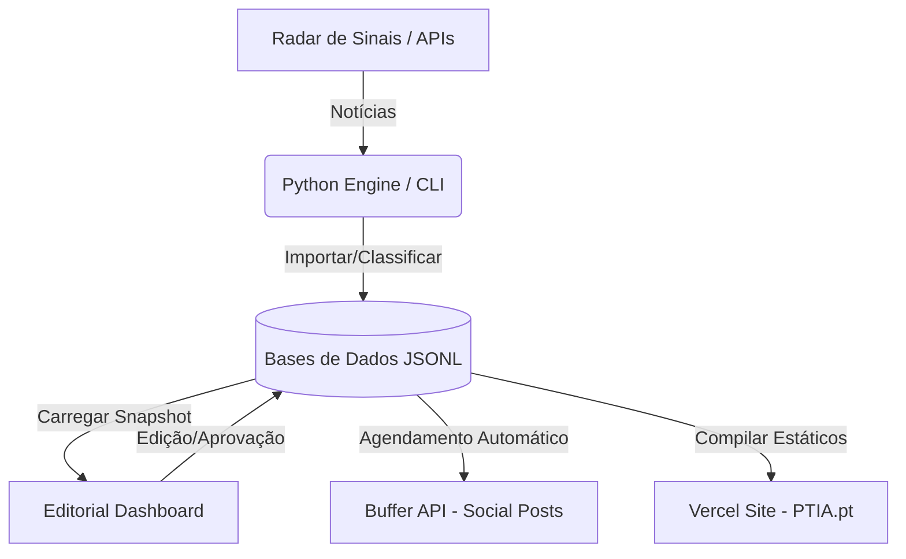

# PTIA Content Engine — Context & Operations Manual


Este ficheiro serve como o **cérebro operacional** e manual de referência rápida para o desenvolvimento, manutenção e curadoria do portal **PTIA.pt**.

---

## 🎯 1. Visão Geral do Projeto

O **PTIA Content Engine** é uma plataforma editorial e curadoria inteligente que filtra o ruído internacional sobre Inteligência Artificial, traduzindo as notícias de ponta para o contexto real de Portugal (**Ângulo PTIA**), focando-se em Decisores, Founders, Startup Builders e Reguladores nacionais.

* **Site Oficial (Produção):** [https://ptia.pt](https://ptia.pt) (Alojado na **Vercel**, deploy automático via ramo `main` do GitHub).
* **Editorial Dashboard (Cloud PaaS):** [https://ptia-dashboard.onrender.com](https://ptia-dashboard.onrender.com) (Alojado no **Render**, 24/7 online para curadoria em mobilidade).

---

## 🏗️ 2. Arquitetura do Sistema



* **`src/ptia_engine/`**: O motor central em Python (crawler, inteligência de rascunhos, classificação multi-categoria e integração de APIs).
* **`site/`**: O portal estático e SPA (Single Page Application) em Vanilla HTML, CSS e JS que corre em [ptia.pt](https://ptia.pt).
* **`data/`**: A base de dados transacional em formato JSONL (focada em performance e escrita atómica para evitar corrupções de dados).
* **`scripts/`**: Scripts de automação diária para agendamento transacional de posts e publicações.

---

## 🛠️ 3. Cheatsheet de Comandos (CLI)

Todos os comandos devem ser executados a partir da raiz do repositório configurando o `PYTHONPATH`:

### Lançar o Dashboard Localmente
Inicia o painel editorial na porta `8765`:
```bash
$env:PYTHONPATH="src"; python -m ptia_engine.cli dashboard --port 8765
```

### Treinar Pesos de Aprendizagem (Closed-Loop)
Analisa o histórico de performance e ajusta as prioridades de classificação automática das próximas notícias em `config/learning_weights.json`:
```bash
$env:PYTHONPATH="src"; python -m ptia_engine.cli learn
```

### Importar Métricas do Instagram (Automático)
Importa métricas recentes das publicações do Instagram diretamente do Meta Graph API para a base de dados de performance local:
```bash
$env:PYTHONPATH="src"; python -m ptia_engine.cli instagram_insights --limit 25
```

---

## 🔑 4. Variáveis de Ambiente Necessárias (`.env.local`)

Para que as integrações externas operem com estabilidade, garanta que as seguintes chaves estão configuradas:

| Variável | Função |
| :--- | :--- |
| **`GEMINI_API_KEY`** | API da Google Gemini para geração e classificação de rascunhos de IA. |
| **`BUFFER_API_KEY`** | Token de acesso para a API do Buffer (agendamento nas redes sociais). |
| **`META_ACCESS_TOKEN`** | Token de acesso de programador para a API do Meta Graph (Instagram). |
| **`META_INSTAGRAM_BUSINESS_ID`** | Identificador de Conta Business de Instagram ligada à sua página de Facebook. |
| **`PTIA_PUBLIC_SITE_URL`** | URL base de produção (`https://ptia.pt`). |

---

## 🏆 5. Ledgers de Conquistas Recentes

### 🔗 Automação de Backlinks Dinâmicos (30 de Maio de 2026)
* **LinkedIn & X**: O motor editorial reformata automaticamente as CTAs dos posts sociais. Em vez de apontar para links externos (como NBC News), injeta o backlink direto para a análise no portal `ptia.pt` (ex: `https://ptia.pt/artigos/slug...`).
* **Regra de 280 caracteres no X**: O gerador calcula as dimensões de forma exata e trunca o tweet mantendo a integridade da ligação ao site.

### 🌐 Validação do Google Search Console (30 de Maio de 2026)
* **Status**: **100% Validado**.
* Inserida a Meta Tag de verificação do Google no cabeçalho do `site/index.html`. A propriedade foi verificada no Google Search Console, ativando o rastreio e indexação orgânica imediata de todos os artigos através do `sitemap.xml`.

### 📧 Newsletter Brevo
* **Status**: Migração do envio para Brevo Free implementada; ativação cloud pendente das credenciais externas.
* O envio semanal usa `scripts/auto_newsletter_scheduler.py`, que gera/reutiliza a issue da sexta-alvo, cria uma campanha Brevo e agenda a entrega para as 09:00 Europe/Lisbon.
* A produção exige `BREVO_API_KEY`, `BREVO_LIST_IDS` e remetente ativo. O preflight bloqueia audiências acima de 300 contactos para respeitar o limite diário gratuito.

### 🚀 Crescimento e Automação Editorial (1 de Junho de 2026)
* **Diretório "Quem é Quem na IA"**: Lançado o banco de dados dinâmico `site/assets/quem-e-quem.json` e a página de alta autoridade SEO `site/quem-e-quem.html` contendo as 21 empresas e 21 personalidades mais relevantes do ecossistema em Portugal. URLs limpos e navbar/footer integrados.
* **LinkedIn PDF Carousels**: Criada a automação de compilação `scripts/generate_linkedin_carousel.py` que lê os 4 principais posts da semana, desenha slides quadrados (1080x1080px) premium e os exporta como um único PDF de alto alcance via Playwright headless (`scripts/render_carousel_pdf.js`).
* **Debate da Semana na Newsletter**: Alterada a lógica do compilador de email `src/ptia_engine/newsletter.py` para extrair debates ativos registados em `data/linkedin_comments.jsonl` e os injetar sob a secção visual premium "Debate da Semana".
* **Automação Hands-free da Newsletter**: `scripts/auto_newsletter_scheduler.py` agenda a Weekly Briefing na Brevo para sexta às 09h00. A deduplicação é feita por `send_at` da sexta-alvo, não por janela móvel de 6 dias, para evitar bloquear a edição semanal por drafts criadas ao domingo.
* **Automação de Tagging no LinkedIn**: Criado o mapeamento inteligente `config/linkedin_urn_map.json` e atualizada a lógica central em `src/ptia_engine/dashboard.py` para converter automaticamente menções a empresas mapeadas (como @Unbabel, @Defined.ai, @NVIDIA) em tags azuis clicáveis (`@[Display Name](urn:li:organization:ID)`), mantendo fallbacks editoriais limpos para menções a pessoas e entidades externas.

### 💬 Motor de Comentários LinkedIn Conceptual-First & Scraper Robusto (2 de Junho de 2026)
* **Novos Limiares de Tração**: Atualizados os thresholds no [linkedin_monitor.json](file:///c:/Users/joaon/ptia-content-engine/config/linkedin_monitor.json) e fallbacks em [linkedin_commenter.py](file:///c:/Users/joaon/ptia-content-engine/src/ptia_engine/linkedin_commenter.py) para reter apenas publicações com **mínimo de 50 likes** ou **mínimo de 10 comentários**, excluindo quaisquer bloqueios/travamentos adicionais.
* **Scraper de Pesquisa Robusto**: Corrigido o seletor em [linkedin_automation.js](file:///c:/Users/joaon/ptia-content-engine/scripts/linkedin_automation.js). Como os cartões da página de pesquisa do LinkedIn não têm `data-urn` no elemento principal, o scraper passou a ler elementos `[role="listitem"]` ou `.reusable-search__result-container` e a extrair o ID via regex a partir da propriedade `userGeneratedContentId` no HTML do bloco.
* **Filtro de Tempo Relativo**: Implementado um regex que procura por dígitos associados a unidades de tempo (ex: `8 min •`, `1 h •`) para extrair a data relativa do post, distinguindo-a de nomes e metadados de utilizadores com visto premium.
* **Reset da Base de Dados**: Limpeza do histórico de comentários antigos em `data/linkedin_comments.jsonl` para iniciar o motor com a nova diretiva puramente conceptual (evitando bajulações/"graxa" e anúncios de features e focando-se em reflexões macro-estruturais).

### Backend Architecture Cleanup & Safe Scheduler (3 de Junho de 2026)
* **Status**: Backend em nivel honesto **82/100**. O sistema esta mais modular, testavel e seguro, sem alteracao ao frontend/fluxo do utilizador.
* **Scheduler DRY**: Criado `src/ptia_engine/scheduler.py` e comando `python -m ptia_engine.cli schedule-day --date YYYY-MM-DD` para preflight seguro, execution plan e simulacao noop de agendamento diario.
* **Safety Gates**: Execucao real de scheduling exige `--execute-real`, `--confirm YYYY-MM-DD` e flags explicitas (`--publish-assets`, `--send-buffer`, `--write-site-feed`). Por defeito nao chama Buffer, Git ou Vercel.
* **Servicos Backend**: Criado pacote `src/ptia_engine/services/` para canais, media, higiene editorial, Gemini polish, site, copy social/X e adapter real protegido.
* **Rotas Separadas**: Extraidas as rotas HTTP para `src/ptia_engine/routes/` por dominio (`static`, `editorial`, `signals`, `topics`, `posts`, `media`, `scheduling`, `newsletter`); `DashboardHandler` ficou como camada fina de HTTP.
* **Garantias Preservadas**: O refactor nao escreve em `data/final_posts.jsonl` nem `data/linkedin_comments.jsonl`, nao altera HTML/CSS/JS do dashboard e nao mexe no engine de comentarios LinkedIn. Nota: `data/linkedin_comments.jsonl` pode mudar por automacoes externas se estiverem ativas.
* **Validacao**: Suite completa com **113 testes OK**, `compileall` OK, JSONL com `bad_count = 0`, dry-run de 2026-06-03 apenas com actions `skipped/already scheduled`.
* **Documento Completo**: Ver `docs/ARCHITECTURE_UPDATE_2026_06_03.md`.

### Growth Loop Foundation (3 de Junho de 2026)
* **Status**: Primeira camada invisivel de growth implementada sem alterar dashboard, fluxo de curadoria, posts ja scheduled ou motor de comentarios LinkedIn.
* **UTM Tracking Futuro**: LinkedIn e X passam a gerar backlinks para artigos com UTMs no plano/scheduling futuro (`utm_source`, `utm_medium`, `utm_campaign`, `utm_content`), sem migracao retroativa de `data/final_posts.jsonl`.
* **Growth CLI**: Novo comando read-only `python -m ptia_engine.cli growth-report` para resumir performance e recomendacoes. Apenas escreve ficheiro se for usado `--out`.
* **Performance Model**: `ContentPerformance` agora aceita campos opcionais de site/newsletter (`site_views`, `unique_visitors`, `newsletter_signups`, `page_url`, `referrer`, UTMs).
* **Validacao**: Suite completa atual com **120 testes OK** e `compileall` OK.
* **Documento Completo**: Ver `docs/GROWTH_LOOP_2026_06_03.md`.

### SEO Discovery Layer (3 de Junho de 2026)
* **Status**: Camada publica de descoberta organica implementada sem alterar o dashboard/fluxo de curadoria.
* **Google News Sitemap**: Criado `site/news-sitemap.xml` com `news:publication`, `news:publication_date` e `news:title` para artigos publicos recentes.
* **Robots/Sitemap/LLMs**: `site/robots.txt` anuncia o News sitemap; `site/sitemap.xml` e `site/llms.txt` incluem paginas tematicas.
* **Paginas Tematicas**: Criadas paginas indexaveis em `/temas/ia-em-portugal/`, `/temas/ia-para-pme/`, `/temas/ai-act/`, `/temas/agentes-de-ia/` e `/temas/trabalho-e-produtividade/`.
* **Internal Linking SEO**: Artigos publicos incluem links contextuais para temas e guias PTIA existentes, com JSON-LD `about`; o gerador ignora posts futuros/nao publicos para nao antecipar conteudo scheduled.
* **Validacao**: XML valido para sitemap, News sitemap e RSS; teste automatizado cobre a geracao; suite atual com **120 testes OK**.
* **Documento Completo**: Ver `docs/SEO_DISCOVERY_2026_06_03.md`.

### AI Visibility / Answer Engine Layer (3 de Junho de 2026)
* **Status**: Camada de citacao AI implementada sem alterar o dashboard, curadoria, posts scheduled ou comentarios LinkedIn.
* **AI Index & LLMs**: Criado `site/ai-index.json` e reescrito `site/llms.txt` para orientar motores AI para perguntas canonicas, guias, temas e paginas de autoridade.
* **Answer Layer**: Criadas 7 paginas em `/perguntas/` para responder diretamente a queries como AI Act para empresas portuguesas, IA para PME, agentes de IA, ChatGPT no trabalho e impacto no emprego.
* **Autoridade Editorial**: Criadas paginas `/sobre/`, `/autor/joao-ferreira/`, `/metodologia-editorial/` e `/fontes-e-criterios/` com schema apropriado.
* **Crawlers AI**: `robots.txt` declara Googlebot, Bingbot, OAI-SearchBot, ChatGPT-User, GPTBot, PerplexityBot, ClaudeBot, anthropic-ai e Google-Extended.
* **CLI Read-only**: Novo comando `python -m ptia_engine.cli ai-visibility-report` para auditar prontidao de AI search; resultado atual local **100/100**.
* **Documento Completo**: Ver `docs/AI_VISIBILITY_2026_06_03.md`.

### Newsletter Production Hardening (6 de Junho de 2026)
* **Fornecedor Brevo Free**: o HTML PTIA é enviado via `htmlContent`, com tags nativas de cancelamento e versão web; o rodapé de marca Brevo é acrescentado pelo plano gratuito.
* **Segurança editorial**: rascunhos de comentários LinkedIn nunca entram na newsletter. Apenas registos `commented`, recentes e com texto publicado podem aparecer, até ao máximo de três.
* **Copy honesta**: linguagem de performance/engagement só é usada quando `content_performance.jsonl` contém resultados mensuráveis; sem dados, a edição assume explicitamente curadoria editorial.
* **Idempotência**: campanhas `scheduled`/`sent` não são duplicadas nem com `--force`; retries reutilizam o `provider_campaign_id`; registos MailerLite antigos continuam legíveis.
* **Automação local**: a tarefa Windows corre `scripts/run_newsletter_task.ps1` às sextas 08:45, usa `--live`, agenda para 09:00 e escreve `data/newsletter_scheduler.log`.
* **Limite atual**: a ativação real depende de credenciais Brevo, lista de subscritores, remetente ativo e audiência máxima de 300 no plano gratuito.
* **Runbook**: ver `docs/NEWSLETTER_AUTOMATION.md`.

### Cloud Automation Foundation (6 de Junho de 2026)
* **Prioridade atual**: tornar a newsletter de sexta-feira totalmente autonoma e independente deste PC, sem alterar criterios editoriais nesta fase.
* **Estado partilhado**: implementado mirror transparente dos JSONL para Firestore, com checksum, escrita atomica local, chunking para ficheiros grandes e controlo de concorrencia.
* **Deploy desta fase**: apenas `state_api`, `newsletter_preflight` e `schedule_weekly_newsletter_cloud`; Instagram e analytics ficam fora da ativacao.
* **Horario garantido**: compilacao sexta as 08:45 `Europe/Lisbon`; Brevo recebe o timestamp ISO com offset de Lisboa e agenda para as 09:00.
* **Seguranca**: Firestore nega acesso direto; o state API exige `PTIA_STATE_TOKEN` dedicado e a integracao fica desligada por feature flag ate ao preflight.
* **Bloqueio externo**: ativacao requer plano Firebase Blaze, login Firebase renovado, API key/lista/remetente Brevo e uma API key Render.
* **Runbook cloud da newsletter**: ver `docs/NEWSLETTER_CLOUD_AUTOMATION.md`.
